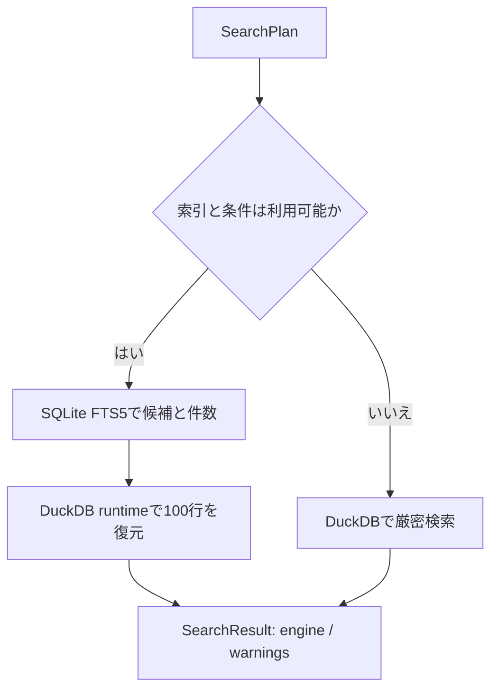

# 検索ワークベンチ UI / 実装契約（2026-08-21）

## 結論

新しいデスクトップ UI の正本は `company_scout/` の React + Tauri/Rust 実装です。法人を探し、条件を絞り、根拠を確認し、検索条件やリストを保存して出力する一連の作業を、一つの検索ワークベンチへ集約します。

`queria_master/desktop_app.py` の Tkinter 版は既存配布との互換性を保つためのレガシー・メンテナンス UI です。新しい操作設計と機能追加は React/Tauri 版を優先し、両 UI の完全な機能同等性は目標にしません。CLI、canonical DB、runtime DB、検索索引は引き続き共通のデータ基盤です。

この文書では「現在の実装」と「今後の課題」を分けます。未実装の機能を完成済みとして扱いません。

## 想定する主要ワークフロー

### 1. 既知の法人をすぐ探す

会社名、13桁の法人番号、所在地、URL、公開済みの電話番号などを一つの検索欄へ入力します。検索種別を先に選ばせず、入力値から安全に解釈し、候補が複数ある場合は所在地・法人種別・法人番号で区別できる一覧を返します。

### 2. 営業・調査対象を条件で作る

都道府県、市区町村、JSIC、従業員数、資本金、設立年、Web/電話の有無、法人種別、キーワードを組み合わせます。適用中の条件はチップとして検索欄の近くに表示し、個別解除と全解除を可能にします。条件パネルは補助であり、検索結果表を常に主役にします。

### 3. 一覧から根拠と欠損を確認する

一覧は会社名、法人番号、所在地、業種、従業員数、資本金、Web/電話の有無など、比較に必要な列へ絞ります。行を選ぶと右側の詳細領域で、値、出典、更新日時、競合や欠損を確認します。詳細確認のたびに別画面へ遷移させません。

### 4. 検索を保存し、対象リストを再利用する

再利用したい検索条件は保存検索にし、対象企業は名前付きリストにします。「画面で選択した行」と「条件に一致する全件」を明示的に分け、意図しない全件処理を防ぎます。CSV/XLSXやSalesforce連携は、画面に表示中の100行ではなく、利用者が選んだ対象範囲を処理します。

### 5. 自然文から条件を作る

「東京のSaaSで従業員30〜300名」のような自然文は、LLMがSQLを生成するのではなく、検証可能な `SearchPlan` へ変換します。生成された条件はチップとフィルターで見える状態にし、利用者が確認・修正してから再検索できます。

## UI 原則

1. **検索入口は一つにする。** 通常検索と自然文検索は同じ結果表・条件モデルを使います。
2. **表を中心にする。** 左に折りたためる条件、中央にネイティブな表、右に詳細パネルを置きます。カードを大量に並べません。
3. **一度に見せる列を絞る。** 既定は7〜8列程度にし、長い事業概要や根拠は詳細側で表示します。
4. **状態を隠さない。** 読み込み中、初期状態、0件、検索失敗、索引フォールバックを別々に表示します。
5. **対象範囲を明記する。** 選択行、現在ページ、条件一致全件を混同させません。
6. **データの確からしさを表示する。** 空欄を推測で埋めず、出典、取得日時、競合、レビュー要否を確認できる設計にします。
7. **高度な項目は段階的に見せる。** 普段使う条件を先に、詳細条件と接続設定を必要時に展開します。

国税庁法人番号は法人を一意に識別する軸として扱い、名称だけの曖昧な自動採用を避けます。公開情報の意味や利用条件は、[国税庁 法人番号公表サイトの利用方法](https://www.houjin-bangou.nta.go.jp/website/riyo-hoho/index.html) と [gBizINFO](https://info.gbiz.go.jp/) を前提にし、API連携時は [gBizINFO API](https://content.info.gbiz.go.jp/api/index.html) の仕様に従います。

## 検索・ページング契約

### 100行のサーバーサイドページング

- `search_companies(plan, page, page_size)` の `page_size` はバックエンドで最大100に制限します。
- フロントエンドは100行単位で要求し、全法人をIPCで受け取ってから仮想スクロールしません。
- `SearchResult.total` は条件一致数、`rows` は現在ページ、`page` と `page_size` は実際に適用した値です。
- 並び順は許可リストから検証し、同値時は法人番号を使って安定させます。
- 数万〜数百万件の出力は専用のCSV/XLSX/リスト処理へ渡し、画面用レスポンスと分離します。

この契約により、検索結果のDOM数だけでなく、DuckDB/SQLiteからRust、Tauri IPC、Reactまでの転送量を一定に保ちます。

### 検索条件

- `text` は社名・所在地・事業概要・事業種目・業種・URL・公開済み連絡先などの横断検索として必ず評価します。
- 市区町村は部分一致を許可し、「横浜市」が「横浜市西区」を含むようにします。
- 法人種別は保存値のコードで比較し、旧UIが保存した日本語ラベルは互換変換します。
- JSICは区切りのない文字列包含ではなく、正規化したカテゴリ、またはコード境界を保つトークンとして評価します。
- Web/電話は「指定なし」「あり」「なし」の3状態にします。

## SQLite FTS5 と DuckDB の役割

### 索引経路

`data/search.sqlite` は `data/queria_runtime.duckdb` の代替ではなく、読み取り専用の副索引です。アプリは次を満たす場合だけ利用します。

- 対応する索引形式・必須テーブル・必須列・FTS5を確認できる
- runtimeと索引の `generation_id` が一致する。世代IDがない互換経路では原本サイズを照合できる
- SQLiteをread-onlyかつquery-onlyで開く
- 指定条件を索引だけで意味を変えずに評価できる

全文候補にはSQLite FTS5の `MATCH` を使い、最終的な表示値は法人番号でruntime DBから復元します。FTS5の仕様は [SQLite FTS5公式ドキュメント](https://sqlite.org/fts5.html) を参照してください。

### DuckDBフォールバック

索引がない、古い、runtimeと世代が違う、必要な列がない、または条件が索引の収録範囲外である場合はDuckDBへフォールバックします。`SearchResult.engine` と `warnings` で利用経路と理由をUIへ返し、性能劣化を無言で隠しません。

DuckDBのART索引は等価条件や選択性の高い検索に有効ですが、すべての部分一致全文検索を置き換えるものではありません。設計判断は [DuckDB Indexing Guide](https://duckdb.org/docs/stable/guides/performance/indexing.html) と [DuckDB Indexes](https://duckdb.org/docs/stable/sql/indexes) に基づきます。

## アクセシビリティ契約

- 一覧は `div` の表現ではなく、`table`、`caption`、`thead`、`th`、`tbody` を使います。
- ソート可能な見出しはボタンとしてキーボード操作でき、現在状態を `aria-sort` で伝えます。
- 検索、保存、出力、ページ送り、詳細パネルをTab/Shift+Tabだけで操作できます。
- フォーカスリングを消さず、本文と操作ラベルのコントラストを確保します。
- 操作対象は原則44px程度を確保し、小さいアイコンだけをクリック対象にしません。
- 読み込み、件数更新、エラー、索引フォールバックは `aria-live` で通知します。
- 詳細パネルやモバイル条件ドロワーを閉じた後は、起点となった行またはボタンへフォーカスを戻します。
- `prefers-reduced-motion` を尊重します。

表の密度と横スクロールの扱いは [デジタル庁デザインシステム: テーブル](https://design.digital.go.jp/dads/components/table/) を参照し、検索候補や補完を追加する場合は [WAI-ARIA Authoring Practices: Combobox](https://www.w3.org/WAI/ARIA/apg/patterns/combobox/) のキーボード契約を満たします。

## この改修で解消した不整合

| 以前の問題 | 解消内容 |
| --- | --- |
| Tauri版が `search.sqlite` を使わず、DuckDBの全文 `ILIKE` を毎回実行していた | 対応条件ではSQLite FTS5を使い、法人番号でruntimeの表示値を復元。利用不能時だけ理由付きでDuckDBへフォールバック |
| UIが最大30,000行を一度に要求し、Rust側は最大50,000行のIPC転送を許していた | 画面検索を最大100行/ページへ制限し、大量出力を専用処理へ分離 |
| 自然文検索が生成する `SearchPlan.text` をDuckDB検索が無視していた | `text` を通常検索とFTSの両方で評価 |
| 法人種別UIの日本語ラベルとDBの数値コードが一致せず0件になった | UIはコードを送信し、旧保存検索の日本語ラベルもバックエンドでコードへ正規化 |
| 市区町村が完全一致で、「横浜市」が「横浜市西区」に一致しなかった | 市区町村をエスケープ済み部分一致へ変更 |
| JSICコードを区切り無視の `%code%` で検索し、誤一致し得た | 正規化カテゴリ索引またはトークン境界を守るコード条件へ変更 |
| runtime表示が証拠付き解決値より基礎値を優先する箇所があった | 住所は `resolved_*`、URLは `effective_company_url` を優先して表示 |
| 索引未使用やフォールバックの理由をUIが判断できなかった | データ状態と検索結果へ索引状態、検索エンジン、警告を追加 |
| 公式サイト電話収集が任意URLをそのまま取得でき、応答サイズにも上限がなかった | HTTP(S)限定、認証情報・非標準ポート・内部/予約IPの拒否、DNS結果の固定、リダイレクト再検証、HTTPS downgrade拒否、応答サイズ/HTML判定を追加 |
| Runtime接続への切替やnative同期失敗時に、既存のローカル会社表を失う可能性があった | ローカル表を `companies_local_snapshot` として保持し、native同期はstagingで件数・一意性・必須値・急減を検証してから入れ替える |
| CSVのテキスト値が表計算ソフトで数式として評価され得た | `=`, `+`, `-`, `@`, TAB, CR, LFで始まる全テキストセルだけにapostropheを付け、NULLと通常値を保持 |

## 優先度付きの残課題

### P0 — 安全性とデータ経路

1. **公式サイト電話収集の運用境界を完成する。** 実ネットワークでDNS rebinding、複数A/AAAA、各種リダイレクト、chunked巨大応答を統合試験し、robots.txt・利用規約・取得頻度の方針を決める。満たせない配布では機能を無効化する（[#19](https://github.com/dj-thank/queria-master/issues/19)）。
2. **Public enrichment公開経路を配布環境で検証する。** staging SQLite → 証拠付きenrichment → runtime → search indexの同一世代更新は接続済み。Windows配布では `QUERIA_MASTER_CLI`、canonical/enrichment/runtime/indexの実パス、途中障害時のDuckDB fallbackをスモーク試験する（[#10](https://github.com/dj-thank/queria-master/issues/10)）。
3. **世代不一致を運用上も復旧可能にする。** UIにruntime/indexのパス、世代、状態、再構築コマンドを示し、誤って古い索引を使わないまま利用者が復旧できるようにする。

### P1 — 判断品質と大量処理

1. **フィールド単位の出典・競合表示。** 会社単位の一つの「出典」ではなく、住所、URL、電話、従業員数など各値の出典、取得日時、競合、レビュー状態を詳細パネルで表示する（[#12](https://github.com/dj-thank/queria-master/issues/12)）。
2. **非同期エクスポート。** 全件CSV/XLSX/Salesforce処理へ進捗、キャンセル、再開、失敗件数、監査ログを追加する（[#13](https://github.com/dj-thank/queria-master/issues/13)）。
3. **保存ビューの完成。** 条件だけでなく、列、並び順、密度を保存し、同じ検索をURLまたは共有可能な設定として再現する。
4. **同名・閉鎖・統合法人の識別。** 法人番号、所在地、法人種別、変更履歴を使い、似た名称の誤選択を減らす。
5. **モバイルのフォーカス契約。** 固定表示になる絞り込み・詳細パネルへdialog semantic、Escape、focus trap、背景inert、起点への復帰を追加し、Windows支援技術で確認する（[#20](https://github.com/dj-thank/queria-master/issues/20)）。

### P2 — 運用整理

1. Tkinter版の保守期限と削除条件を決め、配布ドキュメントとCIの重複を減らす。
2. JSIC分類取込を検索・表示・更新世代へ完全統合するまで、接続画面の孤立した操作を公開しない（[#17](https://github.com/dj-thank/queria-master/issues/17)）。
3. 実データで、索引利用率、フォールバック率、p50/p95、0件率、出力失敗率を計測する。固定の性能値ではなく測定条件と世代を併記する。

## 受け入れ条件

- 全件規模のDBでも、画面検索のIPCレスポンスは最大100行である。
- 同じ条件でページを移動しても、安定した並び順で重複・欠落がない。
- `text`、法人種別、市区町村、JSIC、Web/電話の各条件に回帰テストがある。
- 索引の正常、未配置、古い世代、壊れたスキーマ、対象外条件をテストし、フォールバック理由が返る。
- ローディング、0件、失敗、フォールバック、選択対象、全件対象を視覚と支援技術の両方で区別できる。
- キーボードだけで検索、条件解除、行選択、詳細確認、ページ送りを完了できる。
- 実データを使うWindowsビルドで、検索、保存、CSV出力、接続状態の主要経路を確認する。
